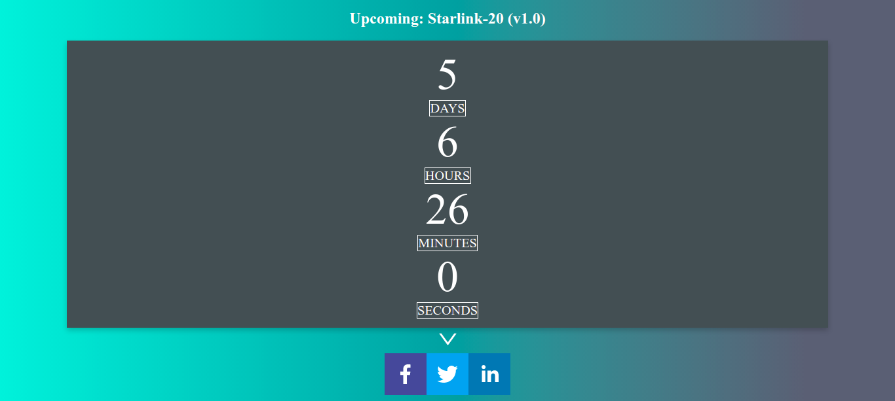
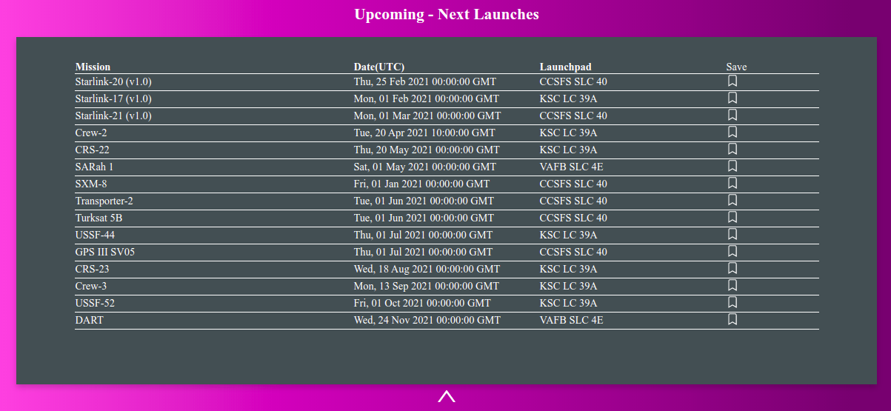
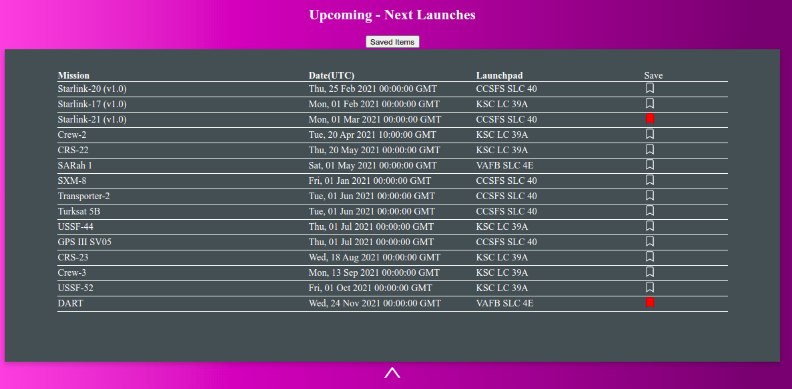
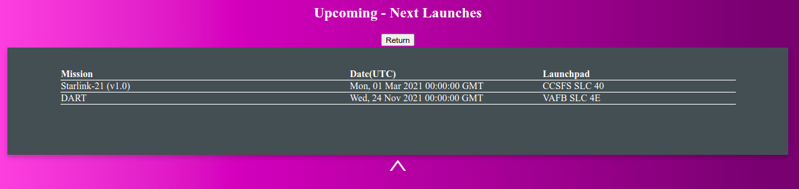

# SpaceX Next Launches React JS project

This is a simple React JS project. The spaceX API is being used here to do two things: 1)display a live counter of the remaining time before the next launch. 2) show a table of all the upcoming launches. The user can save in the browser the launches he's interested with. 

live application: https://spacex-launches-12.netlify.app/  
spaceX API documentation: https://github.com/r-spacex/SpaceX-API/tree/master/docs/v4  
spaceX API base url: https://api.spacexdata.com/v4  

# Next Launch

# Next Launches

# Save Launches

# Saved Items

